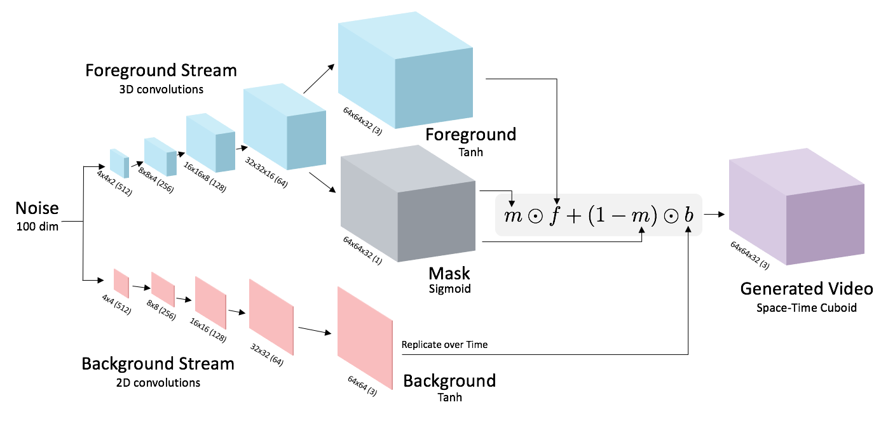
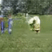
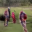
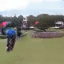
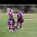

# Generating Videos with Scene Dynamics

## Introduction
This is a Pytorch implementation of "Generating Videos with Scene Dynamics" (https://github.com/cvondrick/videogan).
Codes are largely from a TensorFlow implementation (https://github.com/GV1028/videogan).

## Requirements
This code was tested under Pytorch 1.0.
Required packages: 
* pip install numpy
* pip install pillow
* pip install scikit-image
* pip install scikit-video

## VideoGAN
Please refer to the paper [paper](http://carlvondrick.com/tinyvideo/paper.pdf). 

## Train  
Place *golf* dataset inside a folder `golf`. 
(You can download the dataset from [http://www.cs.columbia.edu/~vondrick/tinyvideo/](http://www.cs.columbia.edu/~vondrick/tinyvideo/)). 
Run `train_golf.py` with the required values in `argparser`.

## Test 
Run `test_golf.py`.

## Results
Below are some of the results on the model trained on *golf* dataset about 3 epochs. 
<table><tr><td>
<strong>Generated videos</strong> 

 

 

 
</td></tr></table>
